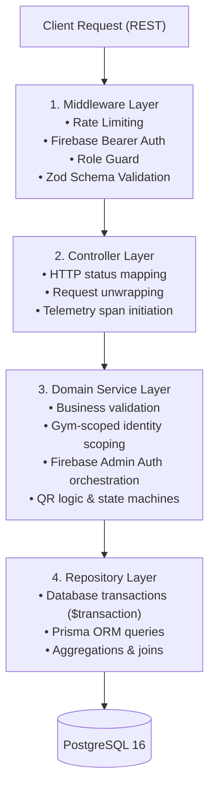
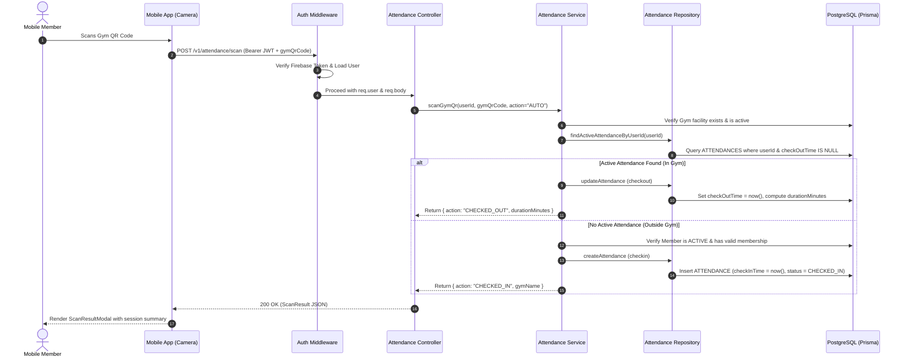
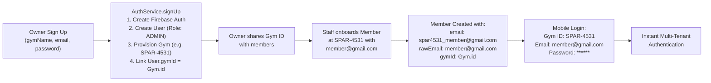

# SyncFit Enterprise: Backend Architecture & Engineering Guide

This document provides a comprehensive architectural reference for the SyncFit RESTful backend service, built with **Express.js**, **TypeScript**, **Prisma ORM**, **PostgreSQL**, and **OpenTelemetry**.

---

## 1. Architectural Patterns & Clean Layering

SyncFit employs a strict **Separation of Concerns (SoC)** and **Layered Architecture**. Every HTTP request flows deterministically through five decoupled layers:



### 1.1 Layer Responsibilities

1. **Routes (`*.routes.ts`)**:
   - Defines URL paths, HTTP verbs, and attaches middleware pipelines in sequence (`authenticate`, `authorizeRoles`, `validate(schema)`).
2. **Middlewares (`src/core/middlewares/`)**:
   - **`auth.middleware.ts`**: Intercepts `Authorization: Bearer <token>`, validates the JWT against Firebase Admin SDK, loads the PostgreSQL `User` record, and attaches `req.user`.
   - **`validate.middleware.ts`**: Validates `req.body`, `req.query`, and `req.params` against strict Zod schemas before reaching the controller.
   - **`error.middleware.ts`**: Centralized error trap. Translates domain exceptions into structured JSON responses with appropriate HTTP codes.
3. **Controllers (`*.controller.ts`)**:
   - Acts as the HTTP transport adapter. Unwraps inputs, wraps execution in OpenTelemetry telemetry spans (`withSpan`), delegates to domain services, and formats standard responses (`res.status().json()`).
4. **Services (`*.service.ts`)**:
   - Contains all domain business logic, transactional invariants, multi-tenant scoping, cryptographic generation (referral codes, alphanumeric gym IDs, QR keys), and external service calls (Firebase Admin).
5. **Repositories (`*.repository.ts`)**:
   - Encapsulates database access. All Prisma Client operations, nested relations, includes, and filters are isolated here.

---

## 2. Request Lifecycle & QR Scan Sequence

The diagram below illustrates the end-to-end flow when a mobile member scans a gym QR pass:



---

## 3. Observability & Telemetry (`withSpan`)

SyncFit features built-in distributed tracing powered by **OpenTelemetry**.

- **Span Wrapper (`src/core/telemetry/tracer.ts`)**:
  All service methods and repository queries are wrapped with `withSpan(name, fn)`:
  ```typescript
  export async function withSpan<T>(
    spanName: string,
    operation: (span: Span) => Promise<T>
  ): Promise<T> { ... }
  ```
- **Automatic Trace Context Propagation**:
  Spans automatically capture execution latencies, database execution times, exception stack traces, and tenant identifiers. Traces are exported via OTLP to Jaeger or OpenTelemetry collectors.

---

## 4. Multi-Tenant Gym Identity Flow

When a Gym Owner registers, SyncFit provisions a multi-tenant environment:



---

## 5. REST API Endpoint Reference

All protected endpoints require an `Authorization: Bearer <Firebase_ID_Token>` header.

### 5.1 Authentication (`/v1/auth`)

| Method | Endpoint | Auth | Description |
| :--- | :--- | :--- | :--- |
| `POST` | `/v1/auth/signup` | Public | Register new user or Gym Owner. When `gymName` is supplied, provisions an alphanumeric Gym ID and assigns `ADMIN` role. |
| `GET` | `/v1/auth/me` | Bearer Token | Fetches the authenticated user profile, active gym facility, current attendance record, and active membership. |

### 5.2 Gym Facility (`/v1/gym`)

| Method | Endpoint | Auth | Description |
| :--- | :--- | :--- | :--- |
| `GET` | `/v1/gym/qr` | Public | Retrieves current gym QR payload and branding details for physical turnstile posters. |
| `GET` | `/v1/gym/lookup/:code` | Public | Validates an alphanumeric Gym ID (e.g., `SPAR-4531`, `SYNCLINK-MAIN`) and returns facility name & capacity. |
| `GET` | `/v1/gym` | Bearer (`ADMIN`) | Lists all gym facilities in the network. |
| `POST` | `/v1/gym` | Bearer (`ADMIN`) | Creates a new gym branch location. |
| `PATCH` | `/v1/gym/:id` | Bearer (`ADMIN`) | Updates gym branch parameters, capacity, address. |
| `POST` | `/v1/gym/qr/regenerate`| Bearer (`ADMIN`)| Invalidates previous QR code key and generates a new secret. |

### 5.3 Attendance & Turnstiles (`/v1/attendance`)

| Method | Endpoint | Auth | Description |
| :--- | :--- | :--- | :--- |
| `POST` | `/v1/attendance/scan` | Bearer Token | Primary QR code scan endpoint. Automatically toggles check-in / check-out. |
| `POST` | `/v1/attendance/check-in` | Bearer Token | Explicit check-in entry request. |
| `POST` | `/v1/attendance/check-out`| Bearer Token | Explicit check-out exit request. Computes total elapsed session duration. |
| `GET` | `/v1/attendance/occupancy`| Public / Auth | Live building occupancy count, capacity percentage, and status. |
| `GET` | `/v1/attendance/members/:id`| Bearer Token | Historical attendance logs and session duration records for a member. |

### 5.4 Members (`/v1/members`)

| Method | Endpoint | Auth | Description |
| :--- | :--- | :--- | :--- |
| `GET` | `/v1/members` | Bearer Token | Paginated member list with search filters by name, email, or status. |
| `POST` | `/v1/members` | Bearer Token | Onboard new member into gym. Scopes account to gym facility. |
| `GET` | `/v1/members/:id` | Bearer Token | Full member dossier including profile, documents, and attendances. |
| `PATCH` | `/v1/members/:id/status` | Bearer (`ADMIN`)| Updates member state (`ACTIVE`, `SUSPENDED`, `INACTIVE`). |

### 5.5 Membership Plans (`/v1/plans`)

| Method | Endpoint | Auth | Description |
| :--- | :--- | :--- | :--- |
| `GET` | `/v1/plans` | Public / Auth | Lists active membership plans (`STANDARD`, `PREMIUM`, `VIP`). |
| `POST` | `/v1/plans` | Bearer (`ADMIN`) | Creates a new tiered membership package. |
| `POST` | `/v1/plans/assign` | Bearer (`ADMIN`) | Subscribes a member to a membership plan. |

---

## 6. Error Handling Architecture

The backend implements a structured exception hierarchy based on `AppError` (`src/core/error/errors.ts`):

| Exception Class | HTTP Status | Standard Use Case |
| :--- | :--- | :--- |
| `BadRequestError` | `400 Bad Request` | Malformed inputs, missing query params |
| `UnauthorizedError` | `401 Unauthorized` | Missing or expired Firebase ID token |
| `ForbiddenError` | `403 Forbidden` | Role mismatch, suspended account access |
| `NotFoundError` | `404 Not Found` | Unknown Gym ID, missing member record |
| `ConflictError` | `409 Conflict` | Member already registered in target gym |
| `InternalServerError` | `500 Server Error` | Unhandled database or third-party error |

All error responses strictly adhere to the standard envelope format:
```json
{
  "success": false,
  "message": "Member with email member@example.com is already registered at Spartan Fitness (SPAR-4531)",
  "error": {
    "code": "CONFLICT_ERROR",
    "details": null
  }
}
```
