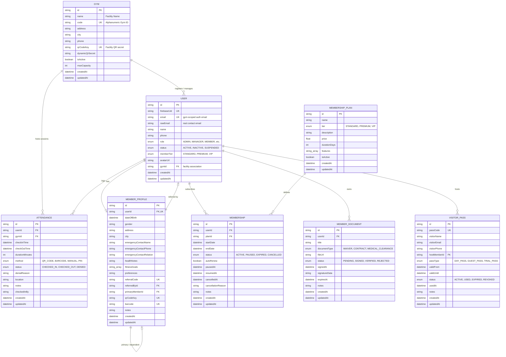

# SyncFit Enterprise: Database Schema Documentation

This document describes the PostgreSQL relational database schema modeled via [Prisma ORM](file:///Users/ajay/Desktop/Work/syncfit/backend/prisma/schema.prisma) for the SyncFit ecosystem.

---

## 1. Entity-Relationship Diagram (ERD)



---

## 2. Model Specifications

### 2.1 `User`
The primary authentication and account entity in SyncFit. Maps 1-to-1 to a Firebase Auth user identity.

| Column | Type | Constraints | Description |
| :--- | :--- | :--- | :--- |
| `id` | `String` (UUID) | `@id`, `@default(uuid())` | Primary key |
| `firebaseUid` | `String` | `@unique` | Firebase Authentication UID |
| `email` | `String` | `@unique` | Gym-scoped email identity (e.g. `pwrz_john@gmail.com` or direct email) |
| `rawEmail` | `String?` | Optional | Original contact email address (allows identical emails across different gyms) |
| `name` | `String?` | Optional | Full display name |
| `phone` | `String?` | Optional | Member contact phone number |
| `role` | `Role` | `@default(MEMBER)` | Access authorization role (`ADMIN`, `MANAGER`, `MEMBER`, etc.) |
| `status` | `UserStatus` | `@default(ACTIVE)` | Account status (`ACTIVE`, `INACTIVE`, `SUSPENDED`, `PENDING`) |
| `memberTier` | `MemberTier?` | `@default(STANDARD)` | Membership tier (`STANDARD`, `PREMIUM`, `VIP`) |
| `avatarUrl` | `String?` | Optional | Profile image URL |
| `gymId` | `String?` | Foreign Key -> `Gym.id` | Associated gym facility |
| `createdAt` | `DateTime` | `@default(now())` | Registration timestamp |
| `updatedAt` | `DateTime` | `@updatedAt` | Automatic update timestamp |

**Relations**:
- `profile`: 1-to-1 relation with `MemberProfile` (`onDelete: Cascade`).
- `gym`: Many-to-1 relation with `Gym` (`onDelete: SetNull`).
- `memberships`: 1-to-many relation with `Membership`.
- `attendances`: 1-to-many relation with `Attendance`.
- `documents`: 1-to-many relation with `MemberDocument`.
- `visitorPasses`: 1-to-many relation with `VisitorPass` (as host).

---

### 2.2 `Gym`
Represents an individual fitness club or facility location. Each facility operates as an isolated tenant with its own alphanumeric Gym ID and QR entry secret.

| Column | Type | Constraints | Description |
| :--- | :--- | :--- | :--- |
| `id` | `String` (UUID) | `@id`, `@default(uuid())` | Primary key |
| `name` | `String` | Required | Facility name (e.g., "Iron Forge Gym") |
| `code` | `String` | `@unique` | Human-readable alphanumeric Gym ID (e.g., `SPAR-4531`, `SYNCLINK-MAIN`) |
| `address` | `String?` | Optional | Physical street address |
| `city` | `String?` | Optional | City / Municipality location |
| `phone` | `String?` | Optional | Front desk contact telephone |
| `qrCodeKey` | `String` | `@unique`, `@default(uuid())` | Secret key encoded in physical facility QR access passes |
| `dynamicQrSecret` | `String?` | Optional | Secret key for rotating dynamic QR displays |
| `isActive` | `Boolean` | `@default(true)` | Facility operating status |
| `maxCapacity` | `Int` | `@default(150)` | Maximum safe concurrent building occupancy |
| `createdAt` | `DateTime` | `@default(now())` | Facility creation date |
| `updatedAt` | `DateTime` | `@updatedAt` | Facility update date |

**Relations**:
- `users`: 1-to-many relation with `User` (owners, staff, and members associated with this facility).
- `attendances`: 1-to-many relation with `Attendance` (all check-in records logged at this facility).

---

### 2.3 `MemberProfile`
Stores member personal details, medical emergency information, fitness goals, and referral data.

| Column | Type | Constraints | Description |
| :--- | :--- | :--- | :--- |
| `id` | `String` (UUID) | `@id`, `@default(uuid())` | Primary key |
| `userId` | `String` | `@unique`, FK -> `User.id` | Cascade-deleted parent user reference |
| `dateOfBirth` | `DateTime?` | Optional | Date of birth |
| `gender` | `String?` | Optional | Gender identity |
| `address` | `String?` | Optional | Residential address |
| `city` | `String?` | Optional | Resident city |
| `emergencyContactName` | `String?` | Optional | Emergency contact full name |
| `emergencyContactPhone` | `String?` | Optional | Emergency contact telephone number |
| `emergencyContactRelation` | `String?` | Optional | Relation (e.g., Spouse, Parent, Friend) |
| `healthNotes` | `String?` | Optional | Medical alerts, allergies, or physical restrictions |
| `fitnessGoals` | `String[]` | `@default([])` | Array of goals (e.g. `["Hypertrophy", "Cardio"]`) |
| `preferences` | `String?` | Optional | Locker, shower, or workout timing preferences |
| `referralCode` | `String?` | `@unique` | Member's personal referral code (e.g., `SF-B82A9C`) |
| `referredById` | `String?` | FK -> `User.id` | User who referred this member |
| `primaryMemberId` | `String?` | FK -> `MemberProfile.id` | Parent member profile for family memberships |
| `qrCodeKey` | `String?` | `@unique` | Personal member barcode/QR key |
| `barcode` | `String?` | `@unique` | Physical RFID or barcode card identifier |
| `notes` | `String?` | Optional | Staff administrative notes |
| `createdAt` | `DateTime` | `@default(now())` | Profile creation timestamp |
| `updatedAt` | `DateTime` | `@updatedAt` | Profile update timestamp |

---

### 2.4 `MembershipPlan`
Defines available membership tiers, pricing, duration, and feature packages.

| Column | Type | Constraints | Description |
| :--- | :--- | :--- | :--- |
| `id` | `String` (UUID) | `@id`, `@default(uuid())` | Primary key |
| `name` | `String` | Required | Plan display name (e.g., "Annual VIP Pass") |
| `tier` | `MemberTier` | `@default(STANDARD)` | Tier classification (`STANDARD`, `PREMIUM`, `VIP`) |
| `description` | `String?` | Optional | Plan terms and descriptions |
| `price` | `Float` | Required | Pricing in local currency |
| `durationDays` | `Int` | Required | Duration in days (e.g., `30` for Monthly, `365` for Annual) |
| `features` | `String[]` | `@default([])` | List of included perks (e.g. `["Sauna Access", "Guest Passes"]`) |
| `isActive` | `Boolean` | `@default(true)` | Availability for new subscriptions |
| `createdAt` | `DateTime` | `@default(now())` | Plan creation timestamp |
| `updatedAt` | `DateTime` | `@updatedAt` | Plan update timestamp |

---

### 2.5 `Membership`
Represents an active or historical member subscription to a `MembershipPlan`.

| Column | Type | Constraints | Description |
| :--- | :--- | :--- | :--- |
| `id` | `String` (UUID) | `@id`, `@default(uuid())` | Primary key |
| `userId` | `String` | FK -> `User.id` | Subscribing member |
| `planId` | `String` | FK -> `MembershipPlan.id` | Subscribed plan package |
| `startDate` | `DateTime` | Required | Subscription activation date |
| `endDate` | `DateTime` | Required | Expiration / renewal due date |
| `status` | `MembershipStatus` | `@default(ACTIVE)` | State (`ACTIVE`, `PAUSED`, `EXPIRED`, `CANCELLED`) |
| `autoRenew` | `Boolean` | `@default(true)` | Automatic billing/renewal flag |
| `pausedAt` | `DateTime?` | Optional | Timestamp when membership was paused |
| `resumedAt` | `DateTime?` | Optional | Timestamp when paused membership was resumed |
| `cancelledAt` | `DateTime?` | Optional | Cancellation timestamp |
| `cancellationReason` | `String?` | Optional | Reason recorded upon cancellation |
| `notes` | `String?` | Optional | Staff notes |
| `createdAt` | `DateTime` | `@default(now())` | Record creation timestamp |
| `updatedAt` | `DateTime` | `@updatedAt` | Record update timestamp |

---

### 2.6 `Attendance`
Tracks entry and exit events, session durations, and access method for gym facilities.

| Column | Type | Constraints | Description |
| :--- | :--- | :--- | :--- |
| `id` | `String` (UUID) | `@id`, `@default(uuid())` | Primary key |
| `userId` | `String` | FK -> `User.id` | Attending member |
| `gymId` | `String?` | FK -> `Gym.id` | Facility where attendance took place |
| `checkInTime` | `DateTime` | `@default(now())` | Session entry timestamp |
| `checkOutTime` | `DateTime?` | Optional | Session departure timestamp (`null` while in-gym) |
| `durationMinutes` | `Int?` | Optional | Computed session duration in minutes |
| `method` | `CheckInMethod` | `@default(MANUAL)` | Entry mode (`QR_CODE`, `BARCODE`, `MANUAL`, `PIN`, etc.) |
| `status` | `AttendanceStatus` | `@default(CHECKED_IN)` | Status (`CHECKED_IN`, `CHECKED_OUT`, `AUTO_CHECKED_OUT`, `DENIED`) |
| `denialReason` | `String?` | Optional | Rejection explanation if access was denied (e.g. Expired Plan) |
| `location` | `String?` | Optional | Gate / turnstile location name |
| `notes` | `String?` | Optional | Check-in remarks |
| `checkedInBy` | `String?` | Optional | Staff ID who verified entry (for manual check-ins) |
| `createdAt` | `DateTime` | `@default(now())` | Creation timestamp |
| `updatedAt` | `DateTime` | `@updatedAt` | Modification timestamp |

---

### 2.7 `MemberDocument` & `VisitorPass`
- **`MemberDocument`**: Stores signed liability waivers, medical clearance forms, and contract PDFs with digital signatures.
- **`VisitorPass`**: Manages guest passes, single-day visitor passes, and trial vouchers linked to host members.

---

## 3. Enumeration Types

```prisma
enum Role {
  ADMIN          // Full facility owner / system administrator
  MANAGER        // Branch supervisor
  FRONT_DESK     // Reception & turnstile staff
  TRAINER        // Personal fitness instructor
  MAINTENANCE    // Facility support staff
  MEMBER         // Registered gym athlete
}

enum UserStatus {
  ACTIVE         // Permitted entry
  INACTIVE       // Dormant account
  SUSPENDED      // Barred from facility access
  PENDING        // Awaiting email/document verification
}

enum MemberTier {
  STANDARD       // Base floor access
  PREMIUM        // Peak hours + group fitness classes
  VIP            // 24/7 access + sauna + towel service + guest privileges
}

enum MembershipStatus {
  ACTIVE
  PAUSED
  EXPIRED
  CANCELLED
  PENDING
}

enum CheckInMethod {
  QR_CODE        // Camera scan of facility poster or member badge
  BARCODE        // Physical card swipe
  MANUAL         // Front desk console override
  CARD           // RFID keyfob tap
  BIOMETRIC      // Fingerprint / facial recognition
  PIN            // Keypad pin entry
}

enum AttendanceStatus {
  CHECKED_IN     // Currently on premises
  CHECKED_OUT    // Session successfully concluded
  AUTO_CHECKED_OUT // System timed out overnight session
  DENIED         // Barred at turnstile
}
```

---

## 4. Multi-Tenant Cross-Gym Strategy

SyncFit implements a **Federated Hybrid Multi-Tenant Identity Model**:

1. **Global Uniqueness vs. Tenant Separation**:
   - In single-tenant systems, `User.email` is globally unique. If a member changes gyms, duplicate email registrations fail.
   - SyncFit stores `rawEmail` (the member's real email, e.g., `member@example.com`) alongside a gym-scoped authentication email in `User.email`:
     $$\text{email} = \text{cleanGymCode} \mathbin{\_} \text{rawEmail}$$
     *Example*: `spar4531_member@example.com` at Spartan Fitness, and `synclinkmain_member@example.com` at SyncFit Flagship.
2. **PostgreSQL & Firebase Harmony**:
   - Both PostgreSQL unique constraints and Firebase Auth account limits are respected without modifying core auth infrastructure.
   - Member John can hold active memberships at Gym A and Gym B simultaneously with completely isolated records, payment terms, and attendance logs.
3. **Foreign Key Integrity**:
   - `User.gymId` links directly to `Gym.id` (`onDelete: SetNull`).
   - `Attendance.gymId` links directly to `Gym.id`, preserving historical analytics even if member accounts change.

---

## 5. Prisma CLI Commands

| Action | Command | Purpose |
| :--- | :--- | :--- |
| **Push Schema Changes** | `npx prisma db push` | Direct sync of `schema.prisma` with PostgreSQL |
| **Regenerate Client** | `npx prisma generate` | Regenerates `@prisma/client` TypeScript types |
| **Inspect via GUI** | `npx prisma studio` | Visual web browser dashboard for database records |
| **Validate Schema** | `npx prisma validate` | Validates syntax and relation constraints |
| **Format Schema** | `npx prisma format` | Auto-formats indentation and attributes |
