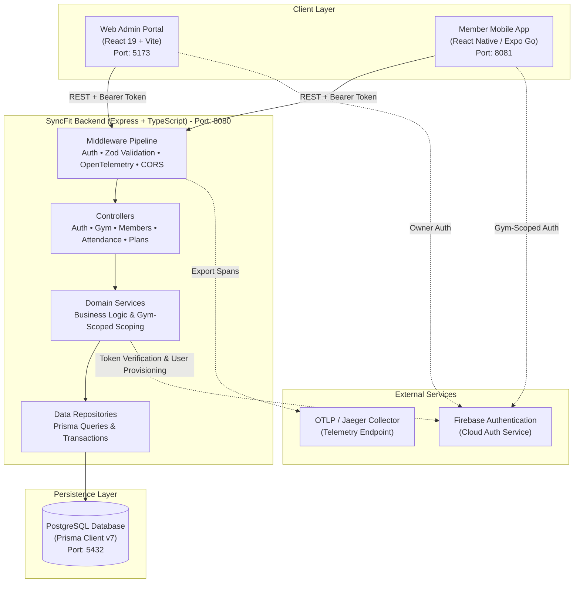

# SyncFit Enterprise: Project Overview & Architecture Guide

Welcome to **SyncFit**, an enterprise-grade, multi-tenant gym and fitness facility management ecosystem. SyncFit bridges the gap between gym owners, front desk operations, hardware turnstiles, and mobile gym members with real-time QR code check-ins, automated attendance tracking, and cross-gym membership isolation.

---

## 1. Executive Summary

SyncFit is engineered to solve modern challenges in fitness club administration and member experience:
- **For Gym Owners & Managers**: A web portal to administer gym facilities, monitor real-time floor occupancy, generate high-resolution QR entry stations (A4 posters, desk acrylic stands, sticker decals), onboard members, manage tiered plans, and track attendance analytics.
- **For Gym Members**: A mobile application (iOS & Android via React Native and Expo Go) enabling member login, camera QR code check-in/out, live in-gym elapsed workout timers, membership status verification, and attendance logs.
- **For Multi-Tenant Operations**: Independent alphanumeric Gym ID provisioning (e.g., `SYNC-8F2B`, `SPAR-4531`), allowing members to belong to multiple gyms using the **exact same personal email and phone number** without database or authentication conflicts.

---

## 2. Core Capabilities

### 2.1 Multi-Tenant Gym Identity
- Every gym facility registered on SyncFit receives a unique, human-readable alphanumeric **Gym ID** (e.g., `SYNC-8F2B`, `SPAR-4531`).
- Gym owners display this Gym ID to members and on wall posters.
- When logging in via the mobile app, members provide their **Gym ID**, **Email**, and **Password**.
- If a member leaves Gym A and joins Gym B, Gym B onboards them with their existing email and phone number. The member simply switches their Gym ID during login to access their new facility as a new, independent member.

### 2.2 Facility QR Code Access System
- **Web QR Station**: Generates standardized, cryptographically signed QR payloads (`SYNCLINK_GYM_ACCESS`).
- **Flexible Print Formats**: High-contrast B&W exports for A4 Turnstile Posters, Counter Desk Stands, and Decal Stickers, ready for 300 DPI physical printing or PDF export.
- **Camera-Based Check-In / Check-Out**: Members scan the facility QR code using the mobile app's built-in camera. The system automatically toggles their status (checking in if outside, checking out if inside).
- **Simulated Test Scanner**: Built-in test scanner mode allows instant verification in emulators and environments without physical cameras.

### 2.3 Real-Time Attendance & Occupancy
- Live count of currently active members on the gym floor.
- Percentage capacity indicators against facility limits.
- Precise session tracking with automated workout duration calculations and checkout logging.

### 2.4 Tiered Membership Lifecycle
- Flexible membership tiers: **STANDARD**, **PREMIUM**, and **VIP**.
- Automated plan assignment, auto-renewal flags, cancellation handling, and pause/resume states.
- Automated database plan bootstrap for instant local setup.

---

## 3. Technology Stack

| Domain | Technology | Version | Purpose |
| :--- | :--- | :--- | :--- |
| **Backend Runtime** | Node.js | v20+ / v24 | Scalable asynchronous execution |
| **Backend Language** | TypeScript | v5.9+ | Static typing, interface contracts |
| **Server Framework** | Express.js | v5 (alpha) | RESTful API routing and middleware pipeline |
| **Database & ORM** | PostgreSQL + Prisma ORM | Prisma v7.10 | Relational database, type-safe migrations & queries |
| **Authentication** | Firebase Admin SDK + Firebase Auth | v12+ | JWT verification, cloud auth identity provider |
| **Telemetry & Tracing**| OpenTelemetry + Jaeger / OTLP | v0.211+ | Distributed span tracing (`withSpan`) & monitoring |
| **Logging** | Winston Logger | v3.19+ | Structured JSON application logging |
| **Web Frontend** | React + Vite | React 19, Vite 8 | Single-Page Application for gym administrators |
| **Styling** | Vanilla CSS Design System | Custom CSS | Dark glassmorphism, responsive layout, print styles |
| **Mobile App** | React Native + Expo Go | React Native 0.86, Expo 57 | Cross-platform member app (iOS & Android) |
| **Mobile Camera** | `expo-camera` | v57 | Native camera stream with barcode scanning |
| **Mobile Storage** | `@react-native-async-storage` | v2.2 | Offline caching for API URLs and active Gym ID |

---

## 4. High-Level System Architecture



---

## 5. Directory Structure Overview

```
syncfit/
├── backend/                  # Express.js REST API with TypeScript & Prisma
│   ├── prisma/
│   │   └── schema.prisma     # PostgreSQL relational schema
│   ├── src/
│   │   ├── attendance/       # Check-in, check-out, QR scan, occupancy
│   │   ├── auth/             # User sign-up, login, Firebase JWT verification
│   │   ├── core/             # Configs, errors, logs, middlewares, telemetry
│   │   ├── gym/              # Facility provisioning, QR payload, gym lookup
│   │   ├── members/          # Member profiles, onboarding, family relations
│   │   ├── membership-plans/ # Tiered plans and subscription assignments
│   │   └── index.ts          # Server bootstrap and route mounting
│   └── package.json
│
├── frontend/                 # React 19 Single-Page Admin Application
│   ├── src/
│   │   ├── api/              # Axios-free Fetch API client wrappers
│   │   ├── components/       # UI components (attendance, members, modals)
│   │   ├── context/          # AuthContext, ToastContext
│   │   ├── pages/            # Dashboard, Members, Gym QR Station, Login
│   │   ├── styles/           # Design system tokens and print layout
│   │   └── App.jsx           # React Router DOM configuration
│   └── package.json
│
├── mobile-app/               # React Native Member Application (Expo 57)
│   ├── src/
│   │   ├── app/              # Expo Router tabs (Home / Explore)
│   │   ├── components/       # LoginScreen, QRScannerModal, ScanResultModal
│   │   ├── config/           # Firebase client initialization
│   │   ├── context/          # AuthContext with multi-tenant Gym ID
│   │   └── services/         # API service with Metro host auto-discovery
│   └── package.json
│
└── docs/                     # Comprehensive technical documentation
    ├── README.md             # Documentation portal index
    ├── PROJECT_OVERVIEW.md   # This document
    ├── DATABASE_SCHEMA.md    # Complete database schema reference
    └── BACKEND_ARCHITECTURE.md# Backend layers, flows, and API reference
```
